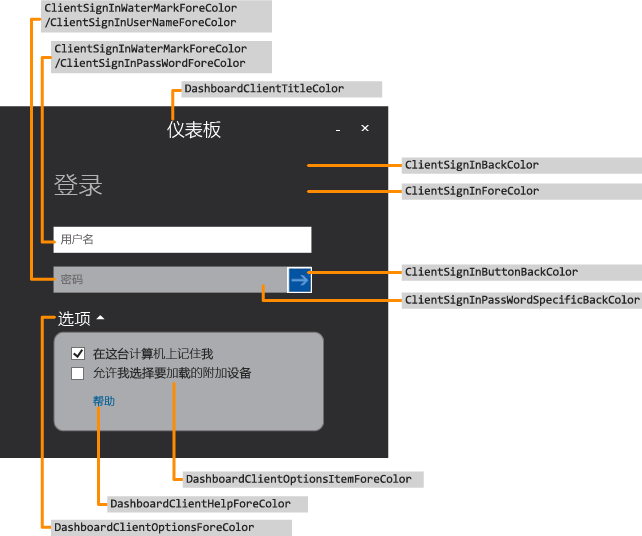
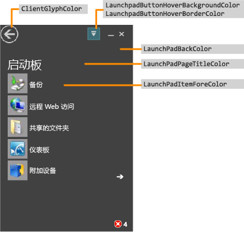
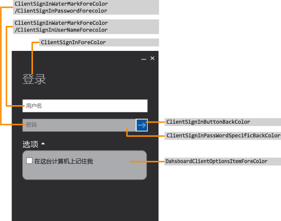
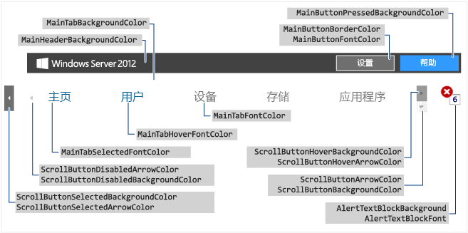
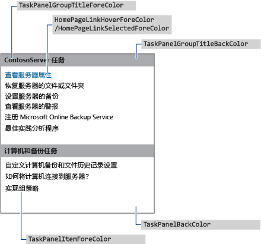
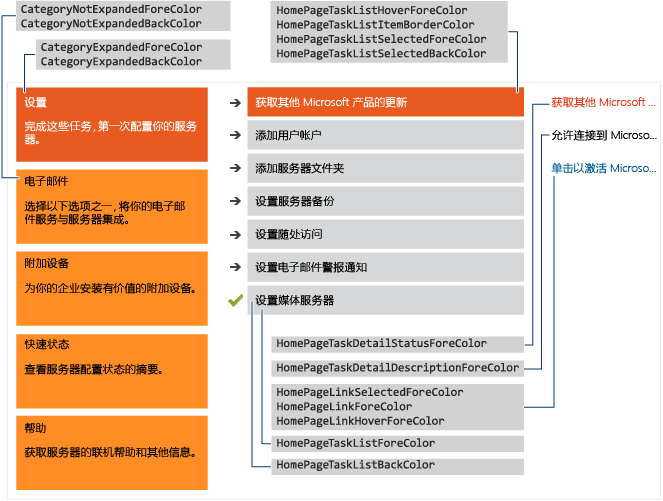

# <a name="change-the-color-scheme-of-the-dashboard-and-launchpad"></a>更改仪表板和启动栏的颜色

>适用于：Windows Server 2016 Essentials，Windows Server 2012 R2 Essentials 中，Windows Server 2012 Essentials

你可以更改仪表板中的配色方案，并且通过定义你想要在 XML 中使用的颜色启动栏安装到文件夹中的服务器上，并通过注册表项中指定.xml 文件名.xml 文件格式的文件。  
  
## <a name="create-the-xml-file"></a>创建 xml 文件  
 下面的示例显示可能 xml 文件的内容：  
  
```xml  
<DashboardTheme xmlns="https://www.microsoft.com/HSBS/Dashboard/Branding/2010">  
  
  <!-- Hex color values overwriting default SKU theme colors -->  
  
    <SplashScreenBackgroundColor HexValue="FFFFFFFF"/>  
    <SplashScreenBorderColor HexValue="FF000000"/>  
    <MainHeaderBackgroundColor HexValue="FF414141"/>  
    <MainTabBackgroundColor HexValue="FFFFFFFF"/>  
    <MainTabFontColor HexValue="FF999999"/>  
    <MainTabHoverFontColor HexValue="FF0072BC"/>  
    <MainTabSelectedFontColor HexValue="FF0072BC"/>  
    <MainButtonPressedBackgroundColor HexValue="FF0072BC"/>  
    <MainButtonFontColor HexValue="FFFFFFFF"/>  
    <MainButtonBorderColor HexValue="FF6E6E6E"/>  
    <ScrollButtonBackgroundColor HexValue="FFF0F0F0"/>  
    <ScrollButtonArrowColor HexValue="FF999999"/>  
    <ScrollButtonHoverBackgroundColor HexValue="FF999999"/>  
    <ScrollButtonHoverArrowColor HexValue="FF6E6E6E"/>  
    <ScrollButtonSelectedBackgroundColor HexValue="FF6E6E6E"/>  
    <ScrollButtonSelectedArrowColor HexValue="FFFFFFFF"/>  
    <ScrollButtonDisabledBackgroundColor HexValue="FFF8F8F8"/>  
    <ScrollButtonDisabledArrowColor HexValue="FFCCCCCC"/>  
    <AlertTextBlockBackground HexValue="FFFFFFFF"/>  
    <AlertTextBlockFont HexValue="FF000000"/>  
    <FontColor HexValue="FF000000"/>  
    <SubTabBarBackgroundColor HexValue="FFFFFFFF"/>  
    <SubTabBackgroundColor HexValue="FFFFFFFF"/>  
    <SubTabSelectedBackgroundColor HexValue="FF414141"/>  
    <SubTabBorderColor HexValue="FF787878"/>  
    <SubTabFontColor HexValue="FF787878"/>  
    <SubTabHoverFontColor HexValue="FF0072BC"/>  
    <SubTabPressedFontColor HexValue="FFFFFFFF"/>  
    <ListViewColor HexValue="FFFFFFFF"/>  
    <PageBorderColor HexValue="FF999999"/>      
    <LaunchpadButtonHoverBorderColor HexValue="FF6BA0B4"/>  
    <LaunchpadButtonHoverBackgroundColor HexValue="FF41788F"/>  
    <ClientArrowColor HexValue="FFFFFFFF"/>  
    <ClientGlyphColor HexValue="FFFFFFFF"/>  
    <SplitterColor HexValue="FF83C6E2"/>  
    <HomePageBackColor     HexValue="FFFFFFFF"/>  
    <CategoryNotExpandedBackColor HexValue="FFFFB343"/>  
    <CategoryExpandedBackColor HexValue="FFF26522"/>  
    <CategoryNotExpandedForeColor HexValue="FF2A2A2A"/>  
    <CategoryExpandedForeColor HexValue="FFFFFFFF"/>  
    <HomePageTaskListForeColor    HexValue="FF2A2A2A"/>  
    <HomePageTaskListBackColor HexValue="FFEAEAEA"/>  
    <HomePageTaskListHoverForeColor      HexValue="FF2A2A2A"/>  
    <HomePageTaskListItemBorderColor     HexValue="FF999999"/>  
    <HomePageTaskListSelectedForeColor   HexValue="FFFFFFFF"/>  
    <HomePageTaskListSelectedBackColor   HexValue="FFF26522"/>  
    <HomePageTaskDetailStatusForeColor   HexValue="FFF26522"/>  
    <HomePageTaskDetailDescriptionForeColor     HexValue="FF2A2A2A"/>  
    <HomePageLinkForeColor HexValue="FF0072BC"/>  
    <HomePageLinkSelectedForeColor HexValue="FF0054A6"/>  
    <HomePageLinkHoverForeColor   HexValue="FF0072BC"/>  
    <PropertyFormForeColor HexValue="FF2A2A2A"/>  
    <PropertyFormTabHoverColor HexValue="FF0072BC"/>  
    <PropertyFormTabSelectedColor HexValue="FFFFFFFF"/>  
    <PropertyFormTabSelectedBackColor HexValue="FF414141"/>  
    <TaskPanelBackColor HexValue="FFFFFFFF"/>  
    <TaskPanelItemForeColor HexValue="FF2A2A2A"/>  
    <TaskPanelGroupTitleForeColor HexValue="FF2A2A2A"/>  
    <TaskPanelGroupTitleBackColor HexValue="FFCCCCCC"/>  
    <DashboardClientBackColor HexValue="FF004050"/>  
    <DashboardClientTitleColor HexValue="FFFFFFFF"/>  
    <DashboardClientOptionsForeColor HexValue="FFFFFFFF"/>  
    <DashboardClientOptionsItemForeColor HexValue="FF2A2A2A"/>  
    <DashboardClientHelpForeColor HexValue="FF0054A6"/>  
    <ClientSignInForeColor HexValue="FFFFFFFF"/>  
    <ClientSignInWaterMarkForeColor HexValue="FF999999"/>  
    <ClientSignInUserNameForeColor HexValue="FF2A2A2A"/>  
    <ClientSignInPassWordSpecificBackColor HexValue="FFCCCCCC"/>  
    <ClientSignInButtonBackColor HexValue="FF004050"/>  
    <ClientSignInPassWordForeColor HexValue="FF2A2A2A"/>  
    <LaunchPadBackColor HexValue="FF004050"/>  
    <LaunchPadPageTitleColor HexValue="FFFFFFFF"/>  
    <LaunchPadItemForeColor HexValue="FFFFFFFF"/>  
  <LaunchPadItemHoverColor HexValue="33FFFFFF"/>  
  <LaunchPadItemIconBackgroundColor HexValue="F2004050"/>  
</DashboardTheme >  
  
```  
  
> [!IMPORTANT]
>  必须在上例中列出的顺序指定 xml 元素。  
  
> [!NOTE]
>  所有值十六进制值特性都属于十六进制值的颜色。 你可以输入你想要使用的任何十六进制的颜色值。  
  
 使用记事本或 Visual Studio 2010 创建包含你希望自定义的区域的标签.xml 文件。 该文件可获得任何名称，但必须具有.xml 扩展。 有关可以自定义在仪表板启动栏的区域中的说明，请参阅[仪表板和启动栏可以更改的领域](Change-the-Color-Scheme-of-the-Dashboard-and-Launchpad.md#BKMK_Dashboard)。  
  
#### <a name="to-install-the-xml-file"></a>若要安装.xml 文件  
  
1.  在服务器上，将鼠标移动到屏幕的右上角，然后单击**搜索**。  
  
2.  在搜索框中，键入**regedit**，然后单击**Regedit**应用程序。  
  
3.  在左侧窗格中，展开**HKEY_LOCAL_MACHINE**，展开**软件**，展开**Microsoft**，展开**Windows Server**。 如果**OEM**键不存在，则你必须完成以下步骤来创建它：  
  
    1.  右键单击**Windows Server**，指向**新建**，然后单击**键**。  
  
    2.  键入**OEM**键的名称。  
  
4.  右键单击**OEM**，指向**新建**，然后单击**字符串值**。  
  
5.  Enter **CustomColorScheme**作为的字符串，并按名称**Enter**。  
  
6.  右键单击**CustomColorScheme**右窗格中，在**修改**。  
  
7.  输入该文件的名称，然后单击**确定**。  
  
8.  将文件复制到 %programFiles%\ Windows Server \Bin\OEM。 如果不存在 OEM 目录，创建它。  
  
##  <a name="BKMK_Dashboard"></a>可以更改的仪表板和启动栏领域  
 此部分中包含可自定义的仪表板和启动栏方面的示例。  
  
### <a name="examples"></a>示例  
  
####  <a name="BKMK_Figure1"></a>图 1：登录页面仪表板  
   
  
####  <a name="BKMK_Figure2"></a>图 2：启动栏  
   
  
####  <a name="BKMK_Figure3"></a>图 3：登录页面的启动栏  
   
  
####  <a name="BKMK_Figure4"></a>图 4：仪表板文本  
   
  
####  <a name="BKMK_Figure5"></a>图 5：调谐边框  
   
  
####  <a name="BKMK_Figure6"></a>图 6: 任务窗格  
   
  
####  <a name="BKMK_Figure9"></a>图 7a：产品闪屏  
   
  
#### <a name="figure-7b-home-page"></a>图 7b：主页  
   
  
## <a name="see-also"></a>请参阅  
 [创建和自定义映像](Creating-and-Customizing-the-Image.md)   
 [其他自定义设置](Additional-Customizations.md)   
 [准备部署该映像](Preparing-the-Image-for-Deployment.md)   
 [测试客户体验](Testing-the-Customer-Experience.md)